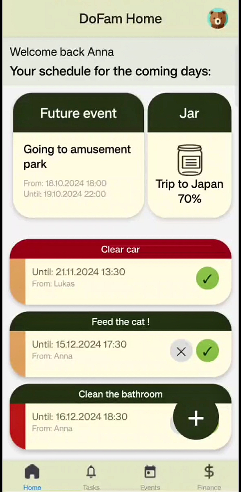
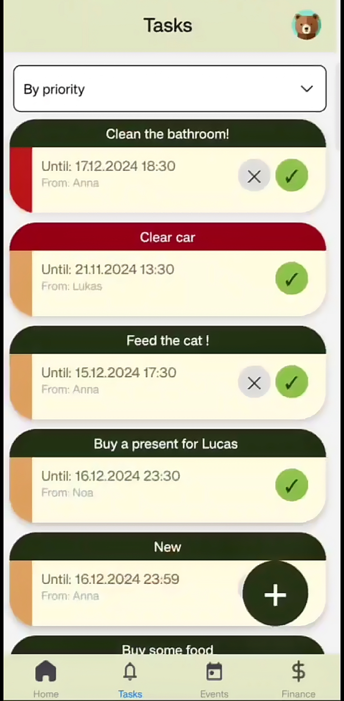
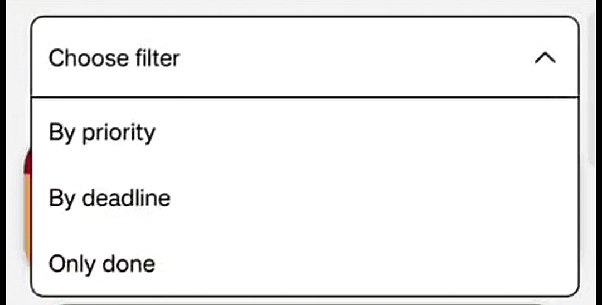
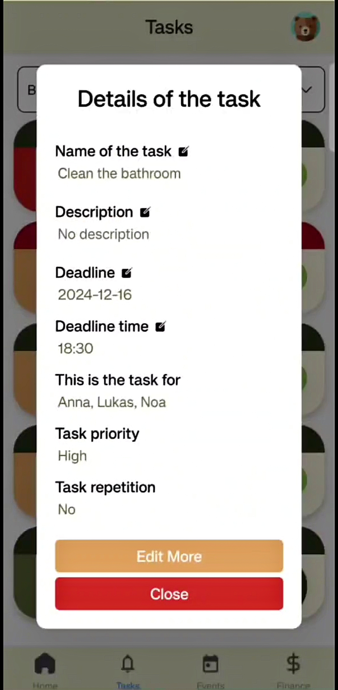
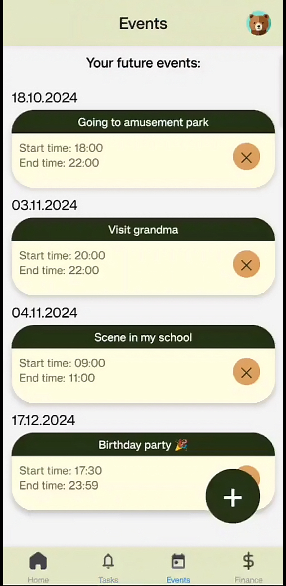
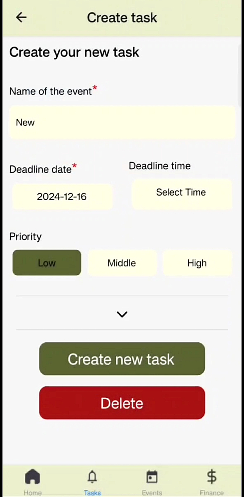
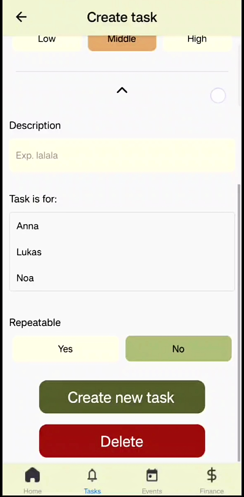

# Build
Our application is using Expo:
```console
$ npm install
...
$ npx expo start
...
```

# My part of implementation

Main parts that i have implemented:

- Home page
- Tasks page
- Events page
- Task/event creation

# Home page
The home screen displays the nearest upcoming event and the three closest tasks based on their deadlines.
Users can:
* View task/event details
* Delete their own tasks
* Quickly access task creation via the Add Task button
<p align="center">  </p>

# Tasks page
The tasks page displays a list of all created tasks, showing their status, priority, and deadline.
Each task can be:
* Viewed in detail
* Edited or deleted (if created by the current user)
* Filtered by various criteria

<p align="center">  </p>

### Filtering
Tasks can be filtered by priority, date, or completion status using the filtering panel at the top.

<p align="center">  </p>

### Viewing and editing
Clicking on a task opens a detailed view where users can see all task information and perform edits.

<p align="center">  </p>

# Events page
The events page shows a list of all upcoming events.
Users can:
* View full event details
* Delete events they created
* Create new events using the Add Event button

<p align="center">  </p>

### Viewing and editing
Clicking on an event opens a detailed view with full information, including date, time, description, and invited members.
Users can also update or delete the event from this view.

# Task/event creation
### When creating a task, the user must provide:
- Name
- Deadline
<p align="center">  </p>

### Optional fields:
- Time
- Priority
- Assigned family member
- Description
- Repeat settings

<p align="center">  </p>

Event creation is similar:
The user must specify:
- Name
- Date

Optional fields include:
- Time
- Description
- Invited members

